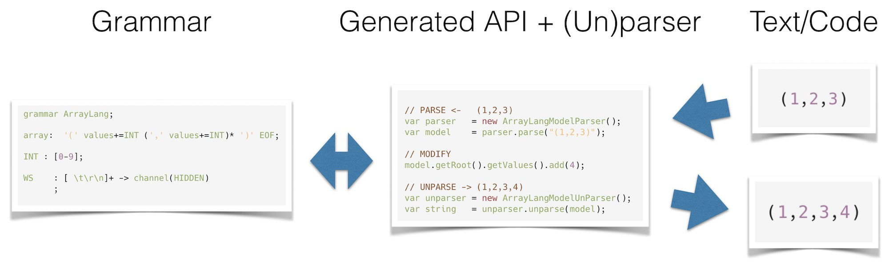

# VMF-Text [](https://twitter.com/intent/tweet?text=VMF-Text:%20The%20new%20framework%20for%20grammar-based%20language%20modeling!&url=https://github.com/miho/VMF-Text&via=mihosoft&hashtags=vmftext,vmf,antlr4,java,mdd,developers)

[  ](https://bintray.com/miho/VMF/VMF-Text/_latestVersion)[](https://gitter.im/VMF_/Lobby?utm_source=badge&utm_medium=badge&utm_campaign=pr-badge&utm_content=badge)

VMF-Text is a novel framework for grammar-based language modeling: give it a labeled [ANTLR4](https://github.com/antlr/antlr4) grammar and it will generate a rich and clean API (using on [VMF](https://github.com/miho/VMF)) for (un)parsing and transforming custom textual languages. The complete API is **derived from just a single ANTLR4 grammar file!**



## Using VMF-Text

Checkout the tutorial projects: https://github.com/miho/VMF-Text-Tutorials

VMF-Text comes with excellent Gradle support. Just add the plugin like so:

```gradle
plugins {
  id "eu.mihosoft.vmftext" version "0.1.2.6" // use latest version
}
```
(optionally) configure VMF-Text:

```gradle
vmfText {
    vmfVersion   = '0.1'   // (runtime version)
    antlrVersion = '4.7.1' // (runtime version)
}
```

Now just add the annotated [ANTLR4](https://github.com/antlr/antlr4) grammar file to the VMF-Text source folder, e.g.: 

```
src/main/vmf-text/my/pkg/ArrayLang.g4
```

Sample grammar for parsing strings of the form `(1,2,3)`:

```antlr
grammar ArrayLang;

array:  '(' values+=INT (',' values+=INT)* ')' EOF;

INT: SIGN? DIGIT+
   ;

fragment SIGN :'-' ;
fragment DIGIT : [0-9];

WS
    : [ \t\r\n]+ -> channel(HIDDEN)
    ;

/*<!vmf-text!>
TypeMap() {
  (INT    -> java.lang.Integer) = 'java.lang.Integer.parseInt(entry.getText())'
}
*/
```

finally call the `vmfTextGenCode` task to generate the implementation.

## Building VMF-Text

### Requirements

- Java >= 1.8
- Internet connection (dependencies are downloaded automatically)
- IDE: [Gradle](http://www.gradle.org/) Plugin (not necessary for command line usage)

### IDE

Open the `VMF-Text` [Gradle](http://www.gradle.org/) project in your favourite IDE (tested with NetBeans 8.2 and IntelliJ 2018) and build it
by calling the `publishToMavenLocal` task.

### Command Line

Navigate to the [Gradle](http://www.gradle.org/) project (e.g., `path/to/VMF-Text`) and enter the following command

#### Bash (Linux/macOS/Cygwin/other Unix shell)

    bash gradlew publishToMavenLocal
    
#### Windows (CMD)

    gradlew publishToMavenLocal

## Testing VMF-Text

Use the test suite [VMF-Text-Tests](https://github.com/miho/VMF-Text-Tests)  TODO
