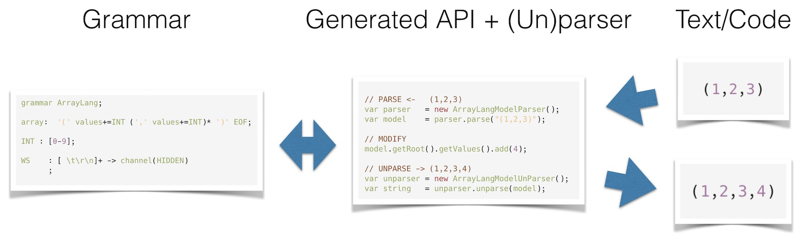

# VMF-Text [](https://twitter.com/intent/tweet?text=VMF-Text:%20The%20new%20framework%20for%20grammar-based%20language%20modeling!&url=https://github.com/miho/VMF-Text&via=mihosoft&hashtags=vmftext,vmf,antlr4,java,mdd,developers)

[](https://github.com/miho/VMF-Text/actions/workflows/ci.yml)
[](https://gitter.im/VMF_/Lobby?utm_source=badge&utm_medium=badge&utm_campaign=pr-badge&utm_content=badge)

VMF-Text is a framework for grammar-based language modeling on the Java Platform (the published artifacts run on Java 11 and later): give it a plain [ANTLR4](https://github.com/antlr/antlr4) grammar — labeled for a curated API, or [auto-labeled](#automatic-labels) as-is — and it generates a rich and clean API (based on [VMF](https://github.com/miho/VMF)) for parsing, transforming and unparsing custom textual languages, with exact round-trip fidelity for parsed sources. **The complete API is derived from just a single ANTLR4 grammar file!**

Wondering how this relates to Xtext, Langium, textX, plain ANTLR4 or JavaParser? See the honest comparison in [COMPARISON.md](COMPARISON.md). Building editor support? See the [LSP integration guide](LSP_INTEGRATION.md).



## Round-Trip Fidelity

VMF-Text preserves the *exact* lexical shape of parsed sources: parse a file
into a typed model, change what you need, unparse — everything you did not
touch is reproduced byte-for-byte, comments, blank lines and irregular
spacing included.

### What “exact” covers (and what it does not)

- **Unedited parsed models** unparse byte-identically.
- **Edits on nested model objects** (e.g. a `MethodDeclaration` or
  `StringLiteral` child) invalidate trivia only on that object. Siblings keep
  their whitespace/comments, so a method rename or string replace typically
  changes just those tokens.
- **Edits to primitive / string properties on a rule** (including flat lists
  like ArrayLang `values+=INT`) clear **all** trivia slots on that rule’s
  `CodeElement`. The formatter then falls back to
  `ConservativeSeparatorPolicy` (usually a single space before lexer tokens).
  So `array.getValues().set(1, 99)` can turn
  `(1 ,  2,\n 3 )` into `( 1, 99, 3)` even though only one value changed.
- **Source bundles** are unrelated to this path: they store original source for
  persistence/restore when semantics still match. They do not improve
  unparse-after-edit formatting.

There is no separate “anchor” API today. Isolation comes from **model-typed
children**: each child `CodeElement` owns its own trivia. Wrapping list items
in a parser rule (e.g. `value: n=INT`) would make ArrayLang behave like the
Java examples. A future core improvement is surgical trivia updates for indexed
primitive list edits (see `LEXICAL_PRESERVATION_ASSESSMENT.md`).

Runnable showcases live under [`examples/`](examples/) and climb in
complexity (all resolve released VMF-Text from Maven Central):

1. **[`examples/arraylang-roundtrip`](examples/arraylang-roundtrip)** — the
   tiny `ArrayLang` grammar from this README. Exact round-trip of an
   irregularly spaced `(1,2,3)` list; then a primitive list edit that
   demonstrates the conservative-separator fallback above.

2. **[`examples/java8-roundtrip`](examples/java8-roundtrip)** — a small Java 8
   source file with a full Java 8 grammar. Rename a method and replace a
   string literal on nested model objects; every other byte stays untouched:

```java
model.vmf().content().stream(MethodDeclaration.class)
     .filter(m -> "greet".equals(m.getMethodName()))
     .forEach(m -> m.setMethodName("sayHello"));

model.vmf().content().stream(StringLiteral.class)
     .filter(lit -> "\"hello\"".equals(lit.getStringValue()))
     .forEach(lit -> lit.setStringValue("\"hello, world\""));
```

3. **[`examples/java24-roundtrip`](examples/java24-roundtrip)** — a real Java
   24 source file (sealed types, records, pattern switches with guards, text
   blocks) with a full Java 24 grammar. One method rename on the model:

```java
model.vmf().content().stream(MethodDeclaration.class)
     .filter(m -> "describe".equals(m.getMethodName().getText()))
     .forEach(m -> m.getMethodName().setText("render"));
```

```
[1] sample/Shapes.java (955 chars) round-tripped byte-identically
  line 27  -     static String describe(Shape shape) {
  line 27  +     static String render(Shape shape) {
[2] one model edit -> one changed line; every other byte is untouched
```

Run any of them:

```
cd examples/arraylang-roundtrip   # or java8-roundtrip / java24-roundtrip
./gradlew run
```

None of this is Java-specific: the same parse → edit → unparse API is
generated for any labeled ANTLR4 grammar.

## Using VMF-Text

Checkout the tutorial projects: https://github.com/miho/VMF-Text-Tutorials

VMF-Text comes with excellent Gradle support. Make sure `mavenCentral()` is
among your plugin repositories in `settings.gradle` (this is where the plugin
and all of its dependencies are published):

```gradle
// settings.gradle
pluginManagement {
    repositories {
        mavenCentral()
        gradlePluginPortal()
    }
}
```

Then add the plugin (click [here](https://plugins.gradle.org/plugin/eu.mihosoft.vmftext) to get the latest version):

```gradle
plugins {
  id "eu.mihosoft.vmftext" version "0.2.0" // use latest version
}
```
(optionally) configure VMF-Text:

```gradle
vmfText {
    vmfVersion   = '0.2.10'  // (runtime version)
    antlrVersion = '4.13.2'  // (runtime version)
    // autoLabel = true      // opt-in: derive labels for unlabeled grammars,
                             // see "Automatic Labels" below
}
```

Now just add the labeled [ANTLR4](https://github.com/antlr/antlr4) grammar file to the VMF-Text source folder, e.g.: 

```
src/main/vmf-text/my/pkg/ArrayLang.g4
```

Sample grammar for parsing strings of the form `(1,2,3)` (see the runnable
[`examples/arraylang-roundtrip`](examples/arraylang-roundtrip) showcase):

```antlr
grammar ArrayLang;

array:  '(' values+=INT (',' values+=INT)* ')' EOF;

INT: SIGN? DIGIT+
   ;

fragment SIGN :'-' ;
fragment DIGIT : [0-9];

WS
    : [ \t\r\n]+ -> channel(HIDDEN)
    ;

/*<!vmf-text!>
TypeMap() {
  (INT    -> java.lang.Integer) = 'java.lang.Integer.parseInt(entry.getText())'
}
*/
```

Finally, call the `vmfTextGenCode` task to generate the implementation.

## Source-Preserving Persistence

VMF-Text now generates a small source bundle helper for every grammar. A source
bundle stores the semantic VMF model together with the original source text and
basic provenance metadata such as grammar name, VMF-Text version and a SHA-256
source checksum.

```java
Java8ModelParser parser = new Java8ModelParser();
Java8Model model = parser.parse(sourceText);

Java8SourceBundle bundle = parser.toSourceBundle(model, sourceText);
Java8Model restored = parser.restoreFromSourceBundle(bundle);
```

Restore follows a conservative source-preserving policy:

1. reparse the bundled source text with the generated grammar;
2. compare the reparsed model with the stored semantic model;
3. return the reparsed model, including fresh lexical-preservation payload, only
   if the semantic models match;
4. otherwise return the stored semantic model after clearing stale VMF-Text
   lexical payload so the normal formatter fallback is used.

This makes source bundles useful for editor and persistence workflows: exact
comments/whitespace are recovered when the source still corresponds to the
model, while semantic model edits or corrupted source text fall back safely to
parseable generated text.

## Automatic Labels

Curated grammars can still use explicit ANTLR labels to define the cleanest
public VMF API. For exploratory or imported grammars, VMF-Text also provides an
opt-in auto-labeling prototype. It is disabled by default and can be enabled
globally from Gradle:

```gradle
vmfText {
    autoLabel = true
}
```

or per grammar via VMF-Text metadata:

```antlr
/*<!vmf-text!>
AutoLabel(enabled=true)
*/
```

Explicit labels always win and mix consistently with auto-labeling. Unlabeled
parser-rule and token references receive deterministic names based on grammar
order; duplicate names receive stable numeric suffixes. Suffix numbering is
scoped to the generated type: in rules whose alternatives become separate typed
sub classes each alternative numbers its names independently. Generated element
names never collide with manually chosen labels (a hand-written `identifier=`
label keeps its name, and an auto-labeled sibling becomes `identifier2`). If a rule
labels only *some* of its alternatives with `#` (which ANTLR rejects on its own,
since alternative labeling is all-or-none), the remaining alternatives are
labeled automatically so the grammar stays valid while the manual labels are
preserved.

Auto-labeling also handles the structural idioms found in default (unlabeled)
ANTLR4 grammars:

- elements that can occur more than once become list properties. This includes
  elements nested inside a repeated block, so `term (('+' | '-') term)*` exposes
  the repeated `term`s as a list instead of collapsing them.
- parser rules with two or more unlabeled top-level alternatives receive
  deterministic `# <Rule>AltN` alternative labels, so each alternative becomes
  its own typed sub class (e.g. `factor : INT | IDENTIFIER | '(' expr ')'`
  yields `FactorAlt1`, `FactorAlt2`, `FactorAlt3` extending `Factor`).
- unnamed operator/separator literals inside a repeated block (such as the
  `('+' | '-')` in `(('+' | '-') term)*` or the `','` in `(',' item)*`) are
  captured as ordered list properties so the exact text is reproduced when
  unparsing instead of being dropped. Token-set groups like `('+' | '-')` are
  captured as one list; multi-token groups like `('[' ']')*` are captured
  element-wise (one ordered list per literal), since ANTLR only allows a
  single label on blocks that form a token set.

Isolated string literals outside of repeated blocks remain syntax and are not
exposed as semantic properties. During generation, VMF-Text prints an auto-label
report that maps grammar element paths to inferred property and alternative
names.

## Typed Lexical Metadata

Parsed `CodeElement`s expose typed lexical metadata via `getLexicalInfo()`.
The typed mirror contains `TriviaPiece` entries (text plus kind), optional-symbol
states, the original code range and a grammar element identifier. Optional-element
presence is available as path-keyed `OptionalState` entries (`getOptionalStates()`),
which the unparser consumes keyed by grammar element path — robust against ordering
divergence, with the flat positional list kept as a derived legacy view.

Freshly parsed models no longer write `vmf-text:` entries into
`CodeElement.getPayload()`; lexical metadata lives exclusively on `LexicalInfo`.
`getPayload()` remains on the API for user-defined extensions but is deprecated
for VMF-Text internals.

The typed metadata is ignored for semantic equality. This allows two models with
the same language semantics but different source trivia to compare as semantic
models, while source-preserving workflows can serialize or inspect the lexical
information explicitly. For semantic-only JSON/schema workflows, omit `LexicalInfo`
from the schema or use source bundles for source-preserving persistence.

Programmatically created models (no parse-time lexical info) consult a pluggable
`ProgrammaticSeparatorPolicy` inside the default formatter. The built-in
`ConservativeSeparatorPolicy` reproduces today's single-space fallback; custom
policies are consulted only where exact preservation is undefined by construction.

The same fallback applies after **primitive property edits** on a parsed
`CodeElement`: changing a non-model-typed property (or a flat primitive list
entry) clears that element’s `TriviaPiece` list, so the formatter no longer has
per-token whitespace to replay. Nested model-typed children keep their own
trivia, which is why Java method/string edits usually preserve surrounding
bytes while ArrayLang `values+=INT` does not. Details and fix options:
`LEXICAL_PRESERVATION_ASSESSMENT.md`.

## Building VMF-Text (Core)

### Requirements

- JDK 21 (build toolchain; the published artifacts run on Java 11+)
- Internet connection (dependencies are downloaded automatically)
- IDE: [Gradle](http://www.gradle.org/) Plugin (not necessary for command line usage)

### IDE

Open the `VMF-Text/core` [Gradle](http://www.gradle.org/) project in your favourite IDE (tested with NetBeans 8.2 and IntelliJ 2018) and build it
by calling the `publishToMavenLocal` task.

### Command Line

Navigate to the [Gradle](http://www.gradle.org/) project (i.e., `path/to/VMF-Text/core`) and enter the following command

#### Bash (Linux/macOS/Cygwin/other Unix shell)

    bash gradlew publishToMavenLocal
    
#### Windows (CMD)

    gradlew publishToMavenLocal

## Building VMF-Text (Gradle Plugin)

### Requirements

- JDK 21 (build toolchain; the published artifacts run on Java 11+)
- Internet connection (dependencies are downloaded automatically)
- IDE: [Gradle](http://www.gradle.org/) Plugin (not necessary for command line usage)

### IDE

Open the `VMF-Text/gradle-plugin` [Gradle](http://www.gradle.org/) project in your favourite IDE (tested with NetBeans 8.2 and IntelliJ 2018) and build it
by calling the `publishToMavenLocal` task.

### Command Line

Navigate to the [Gradle](http://www.gradle.org/) project (i.e., `path/to/VMF-Text/gradle-plugin`) and enter the following command

#### Bash (Linux/macOS/Cygwin/other Unix shell)

    bash gradlew publishToMavenLocal
    
#### Windows (CMD)

    gradlew publishToMavenLocal 

## Testing VMF-Text (Core & Plugin)

To execute the test suite, navigate to the test project (i.e., `path/to/VMF-Text/test-suite`) and enter the following command

#### Bash (Linux/macOS/Cygwin/other Unix shell)

    bash gradlew test
    
#### Windows (CMD)

    gradlew test

This will use the latest snapshot vmf-text and gradle-plugin to execute the tests defined in the test-suite project.

### Viewing the Report

An HTML version of the test report is located in the build folder `test-suite/build/reports/tests/test/index.html`.
